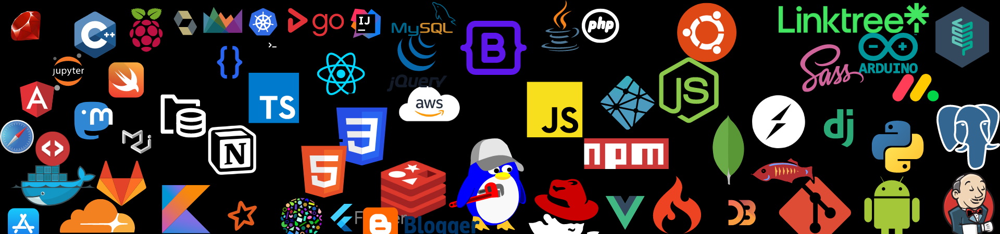

# Hi there 👋

I'm a Alexander Novikov, Software Developer focusing on Python.  
 

 

Here are some ideas to get you started:

- 🌱 I’m currently concentrated on Python and microservices
- 📫 How to reach me: aln1221990@gmail.com

<h3>🚀 Some Tools I Use</h3>

### Github stats

